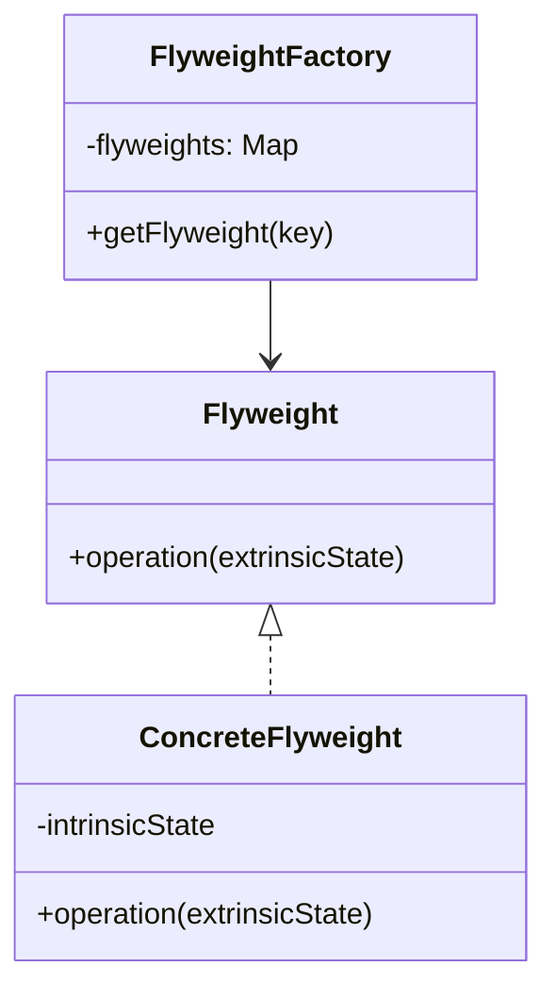

# Flyweight Pattern

## What is the Flyweight Pattern?
The **Flyweight Pattern** is a structural design pattern that aims to minimize memory usage or computational costs by sharing as much data as possible with similar objects. It separates object properties into:
- **Intrinsic state**: Shared, immutable data common to many objects.
- **Extrinsic state**: Unique, contextual data supplied from outside the object.

Instead of creating multiple identical objects, the Flyweight Pattern reuses existing instances, reducing resource consumption.

---

## When to Use It?
- When you need to create **a large number of similar objects**.
- When the **intrinsic state can be shared** safely across different contexts.
- When **memory footprint** is a critical concern.

**Examples:**
- Rendering thousands of characters in a text editor (glyphs).
- Game development (e.g., reusing sprites for trees, enemies).
- Large document processing where many elements are visually identical.

---

## Benefits
- **Reduced memory usage** by sharing common parts of objects.
- **Improved performance** in systems handling many similar objects.
- Better separation between shared (intrinsic) and unique (extrinsic) data.

---

## Drawbacks
- **Increased complexity** in code structure.
- Requires careful management of **intrinsic vs extrinsic state**.
- May cause confusion if state separation is unclear.
- Might **not be beneficial** if the number of shared objects is small.

---

## How to Implement
1. **Identify intrinsic and extrinsic state**.
2. **Create a Flyweight interface** defining common methods.
3. **Implement concrete flyweight classes** for shared objects.
4. **Use a Flyweight Factory** to manage object reuse.
5. Store extrinsic state externally and pass it when needed.

---

## UML Diagram

---

## Example (Language-Agnostic)

Imagine a document editor rendering characters:

- **Intrinsic state**: Font type, font size, style — same for many characters.
- **Extrinsic state**: Position (x, y), color — different for each character.

Instead of creating a new object for every character, reuse a `Character` flyweight for each font/style combination, passing position and color when drawing.

---

## When NOT to Use
- When objects have **little or no shared state**.
- When **memory is not a concern**.
- When **state separation is too complex** and hurts maintainability.

---

## Summary
The Flyweight Pattern is powerful for optimizing performance and memory in systems with many similar objects. However, it comes at the cost of added complexity, so it’s best used in high-scale scenarios where object sharing has measurable benefits.
