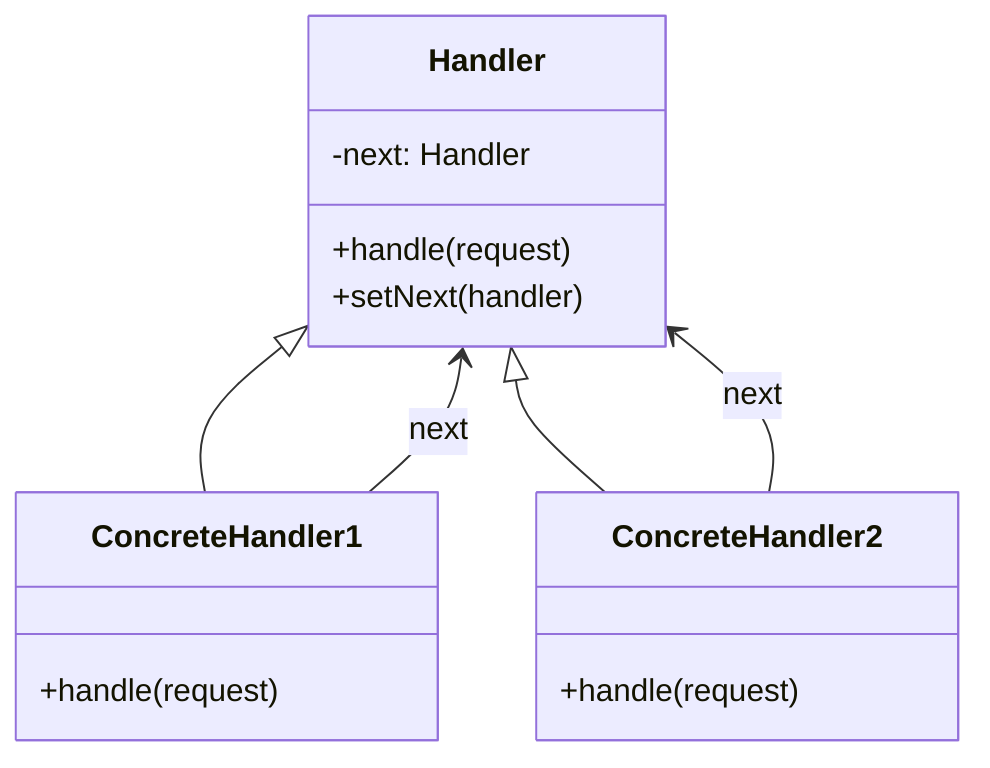

# Chain of Responsibility Pattern

## 1. What Is It?

The **Chain of Responsibility (CoR)** is a behavioral design pattern that lets you pass requests along a chain of handlers. Each handler decides either to process the request or pass it to the next handler in the chain.

The key idea:  
> The sender of a request is decoupled from the receiver(s), and multiple receivers can handle the request in sequence.

---

## 2. Why Use It?

- **Flexibility**: Easily add, remove, or reorder handlers without changing client code.
- **Decoupling**: The client doesn't need to know which object will handle the request.
- **Single Responsibility Principle**: Each handler focuses on a specific condition or type of request.

---

## 3. When to Use

- You have multiple possible handlers for a request, and the handler isn't known in advance.
- You want to process requests in a **pipeline** style.
- You want to avoid complex `if/else` or `switch` statements scattered across the code.
- You expect to change the set of handlers dynamically.

---

## 4. When **Not** to Use

- When the request **must** be handled by exactly one known component (a direct call is simpler).
- When performance is critical and the chain might become **too long** (causing unnecessary overhead).
- When request processing order is **strict and fixed** — the flexibility of CoR becomes unnecessary.

---

## 5. Structure Diagram



---

## 6. Implementation Steps (Language-Agnostic)

1. **Create a Handler interface or abstract class**  
   - Declares a method `handle(request)`  
   - Holds a reference to the next handler

2. **Implement Concrete Handlers**  
   - Each handler processes the request if possible, otherwise calls the next handler

3. **Chain the Handlers**  
   - Link handler objects in the desired order

4. **Send Request**  
   - Pass the request to the first handler in the chain

---

## 7. Example Scenario (Conceptual)

**Problem**: Customer support has multiple levels — Level 1 (basic), Level 2 (technical), Level 3 (specialist).

**Chain Setup**:
```
Level 1 Support → Level 2 Support → Level 3 Support
```

**Flow**:
- Customer request enters Level 1.
- If Level 1 can solve it → done.
- Else, it passes to Level 2.
- If Level 2 can solve it → done.
- Else, it passes to Level 3.

---

## 8. Benefits

- **Loose Coupling** between sender and receiver.
- **Open/Closed Principle**: Add new handlers without modifying existing ones.
- **Reusability**: Handlers can be reused in different chains.

---

## 9. Drawbacks

- The request might go through **many handlers** before being processed.
- **Debugging complexity** increases when chains are long.
- The request could **end up unhandled** if no handler takes responsibility.

---

## 10. Real-World Examples

- **Middleware in Web Frameworks** (e.g., authentication, logging, compression)
- **Event handling systems**
- **Technical support escalation**
- **Approval workflows** in business processes

---
