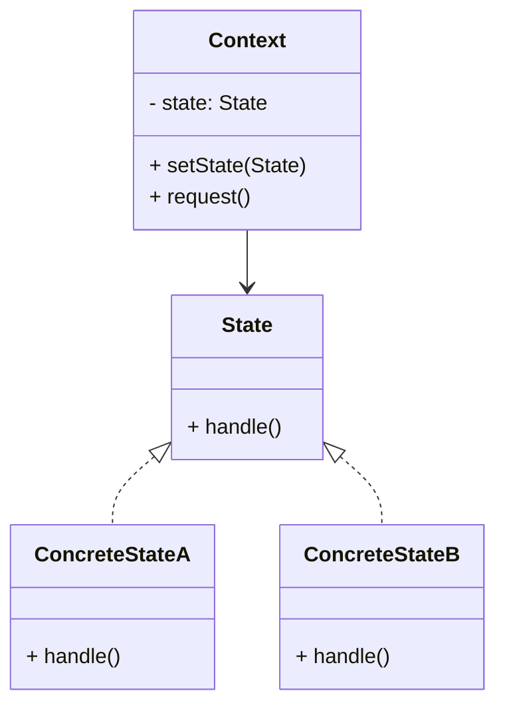

# State Design Pattern

## What is the State Pattern?

The **State Pattern** is a **behavioral design pattern** that allows an object to change its behavior when its internal state changes. 
It appears as if the object changes its class at runtime.  
Instead of using long `if-else` or `switch` statements, each state is represented as a separate class.

---

## Why Use the State Pattern?

- Avoids complex conditional logic based on state.
- Improves **readability** and **maintainability** of code.
- Allows adding new states without modifying the context class.
- Encapsulates state-specific behavior in dedicated classes.

---

## When to Use?

Use the State Pattern when:
- An object must change its behavior depending on its state.
- You want to avoid a large number of conditionals controlling behavior.
- State transitions need to be explicit and controlled.

Examples:
- Order lifecycle: Pending → Paid → Shipped → Delivered.
- Ticket system: Open → InProgress → Resolved → Closed.
- Media player: Playing → Paused → Stopped.

---

## When NOT to Use?

Avoid the State Pattern when:
- The object has very few states, and adding multiple classes makes it unnecessarily complex.
- State changes are rare, or conditional logic is simpler and more maintainable.

---

## Structure

- **Context**: The object whose behavior changes depending on its state.
- **State Interface**: Declares the methods that each state should implement.
- **Concrete States**: Implement behaviors specific to a particular state.

---

## UML Diagram

---

## Example (Conceptual)

Imagine a **Document** that can be in different states:

- **Draft**
- **Moderation**
- **Published**

Each state defines how the document behaves when the user calls `publish()`.

---

## Steps to Implement

1. Define a **State Interface** that declares common methods.
2. Implement **Concrete State Classes** for each state.
3. Add a **Context Class** that keeps a reference to the current state.
4. Delegate behavior to the current state instead of using conditionals.
5. Implement transitions inside the state classes or the context.

---

## Benefits

- Cleaner code with no giant conditional blocks.
- Makes adding/removing states easier.
- Each state is independent and reusable.

---

## Drawbacks

- More classes to manage (increased complexity).
- Can be overkill for simple scenarios.

---

## Summary

The **State Pattern** is ideal when objects must alter their behavior dynamically depending on state. 
It makes the codebase more extensible and easier to maintain but should be avoided for overly simple state management scenarios.
